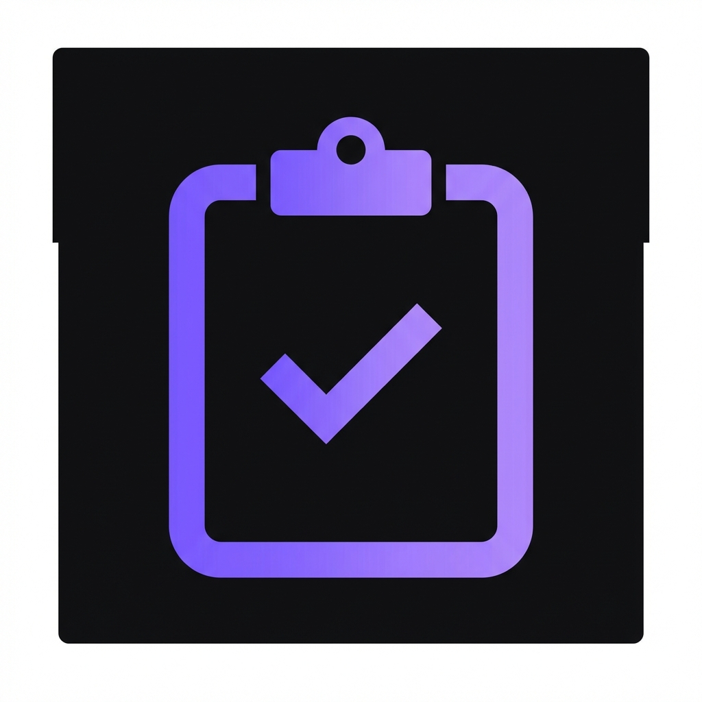

# 📋 Clipboard Vault

A sleek, modern Chrome extension for managing your clipboard. Store multiple snippets, copy them with one click, and never lose important text again.



## ✨ Features

- **📌 Persistent Storage** - Your clips survive browser restarts
- **⚡ One-Click Copy** - Click any item to instantly copy it
- **✏️ Inline Editing** - Double-click to edit items directly
- **🗑️ Easy Delete** - Remove clips you no longer need
- **🔍 Quick Search** - Filter through your saved clips
- **🎨 Modern UI** - Beautiful dark theme with smooth animations

## 🚀 Installation

1. Clone or download this repository
2. Open Chrome and navigate to `chrome://extensions/`
3. Enable **Developer mode** (toggle in the top right)
4. Click **Load unpacked**
5. Select the `browser-clipboard` folder
6. Pin the extension to your toolbar for quick access!

## 📖 Usage

| Action            | How                                                   |
| ----------------- | ----------------------------------------------------- |
| **Add a clip**    | Type or paste in the input area, click "Add to Vault" |
| **Copy a clip**   | Click on the text or the copy button                  |
| **Edit a clip**   | Double-click on the text                              |
| **Delete a clip** | Click the trash icon                                  |
| **Search**        | Type in the search bar to filter clips                |

### Keyboard Shortcuts

- `Ctrl/Cmd + Enter` - Add new clip (when input is focused)
- `Enter` - Save edit
- `Escape` - Cancel edit

## 🛠️ Tech Stack

- **Manifest V3** - Latest Chrome extension standard
- **Chrome Storage API** - For persistent data
- **Vanilla JS** - No dependencies, fast and lightweight
- **Modern CSS** - Custom properties, animations, glassmorphism

## 📁 Project Structure

```
browser-clipboard/
├── manifest.json    # Extension configuration
├── popup.html       # Main popup UI
├── popup.css        # Styling
├── popup.js         # Core functionality
└── icons/           # Extension icons
    ├── icon16.png
    ├── icon32.png
    ├── icon48.png
    └── icon128.png
```

## 🔒 Permissions

- `storage` - To save your clips locally
- `clipboardWrite` - To copy text to your clipboard

Your data never leaves your browser. Everything is stored locally.

## 📄 License

MIT License - feel free to use, modify, and distribute!

---

Made with 💜 for productivity
